# sEMG based Bionic-arm based on Neural Network

The project "Electromyography signals to control prosthetic hands" focuses on developing a prosthetic arm controlled by electromyography (EMG) signals generated by the user's arm. Deep learning techniques are employed to process the EMG signals and accurately interpret them for controlling the movements of the prosthetic hand. The goal is to analyze patterns in the EMG signals, enabling individuals without hands to operate a prosthetic arm through the use of EMG signals and deep learning algorithms. The project involves collecting and transmitting the EMG signals to a microcontroller, which then passes the data to an artificial neural network for training. After extensive training using various datasets, the prosthetic arm is connected, and the accuracy of the results is tested. Ultimately, the research aims to provide assistance to handless individuals by utilizing the findings to develop an effective prosthetic arm.

## System Flowchart

  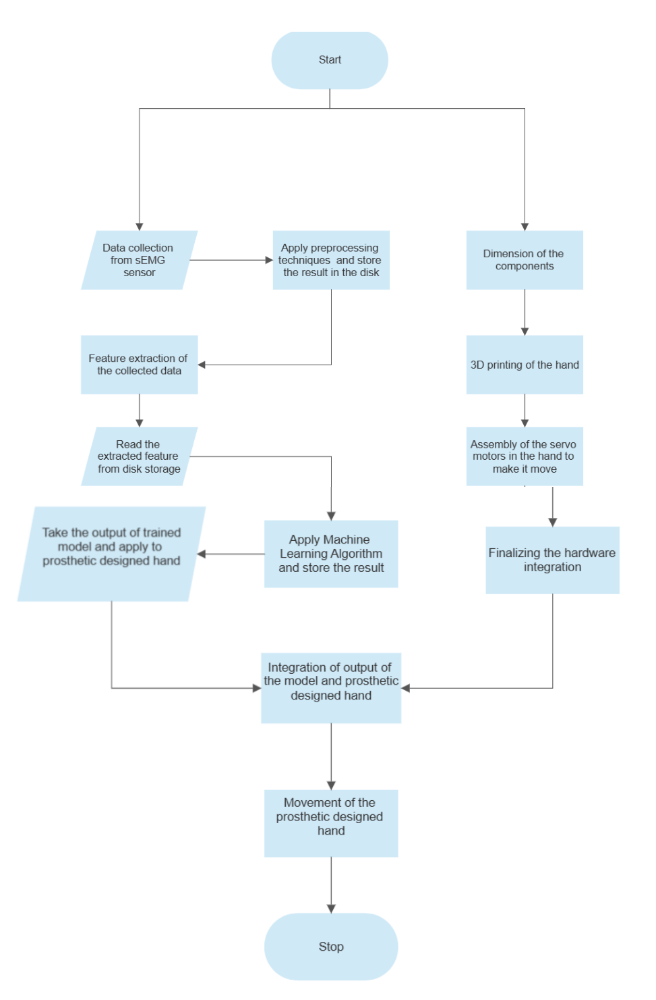

  
## Sensor Used

We used two Grove sEMG sensor 
  
- 3.5mm Connector
- 6 Disposable Surface Electrodes
- Power supply voltage: 3.3V-5V
- 1000mm Cable Leads
- No additional power supply
  
https://wiki.seeedstudio.com/Grove-EMG_Detector/

  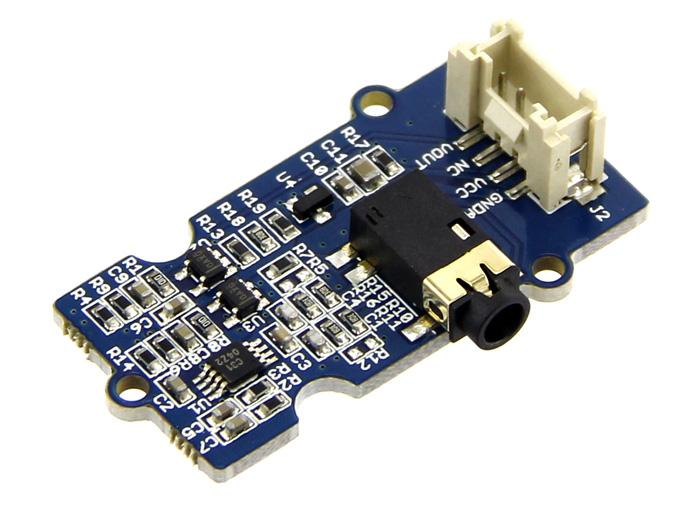

  
 ## Data Collection and Preprocessing
 
 - 2 channel EMG sensor were placed at wrist
 - Two classes, paper and scissors, each having 300 data points
 - Each data point having 6 Second window period
 - Noramlisation and Indexing during preprocessing
 
 

  
  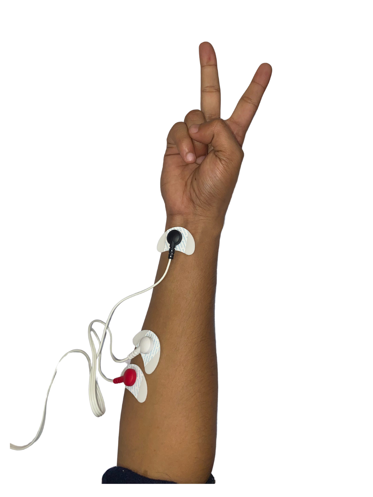

 
  
 ## Feature Extraction 
 
 Fourteen different features types were extracted from preprocessed dataset
 
- Standard Deviation
- Root Mean Square
- Minimum
- Maximum
- Slope Sign Change
- Kurtosis
- Mean Absolute Deviation
- Willison Amplitude
- Waveform Length
- Mean Absolute Value
- Amplitude First Burst
- Average Amplitude Change
- Zero Crossings
- Auto Regression
  
## Model Architecture

A simple neural network layer is used to classify two type of signals

  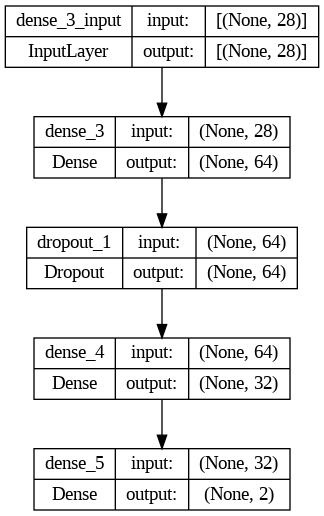

  
## 3D printed parts

  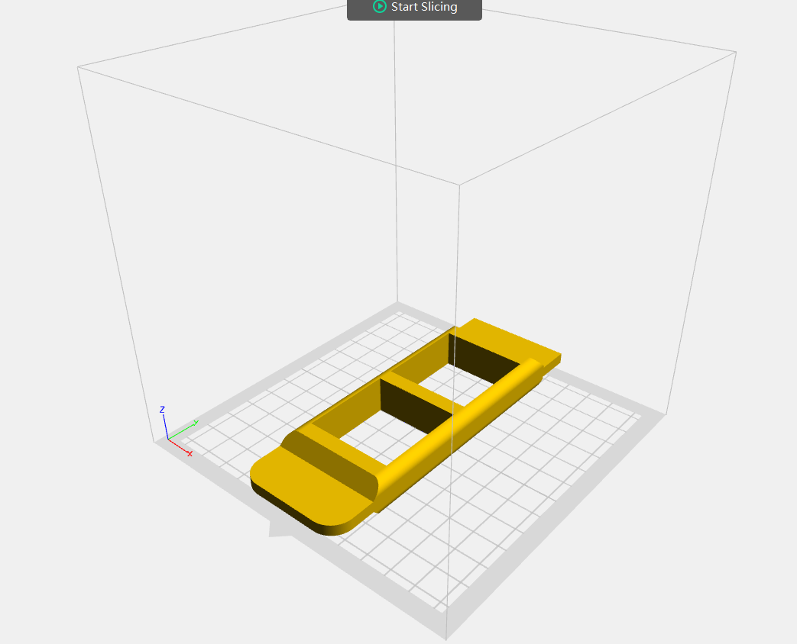
  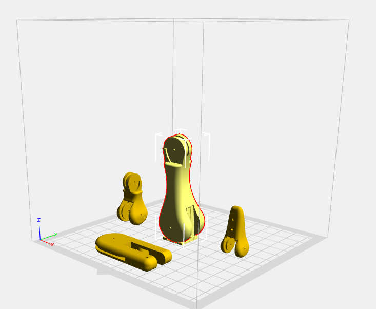
  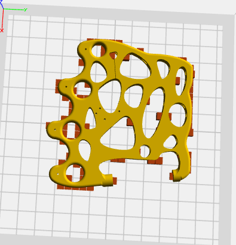
  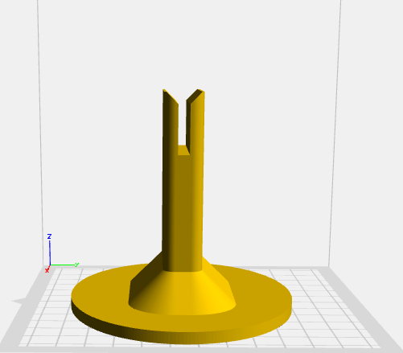

    
## Final Outputs
 
 The final Bionic arm along with a video showing the prediction of saved data in csv file. After model predicts the class 
 the arm shows the corresponding finger motion. 
 
 Also the confusion matrix on test data is shown below.
 
 

  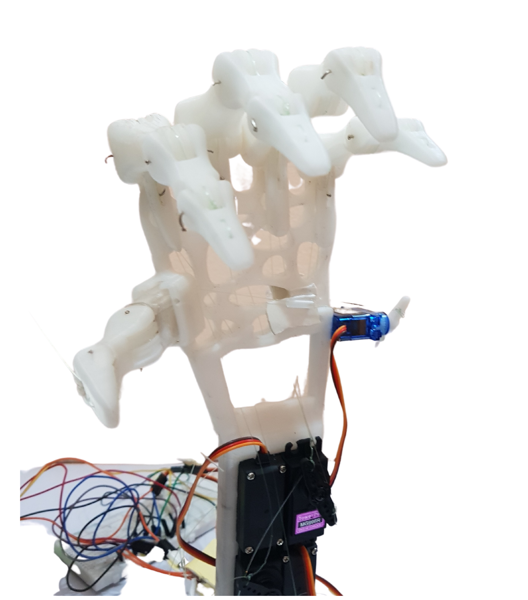
  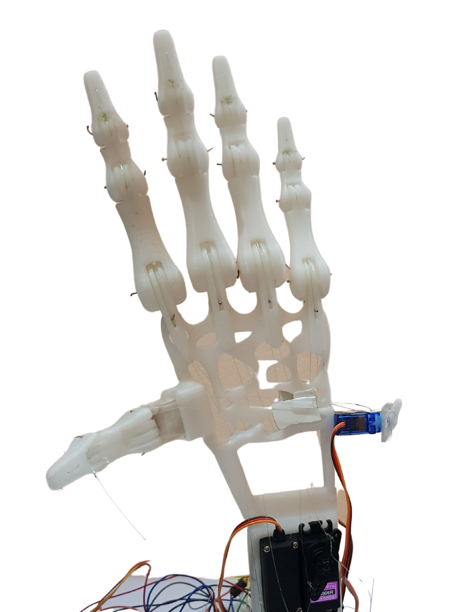
  [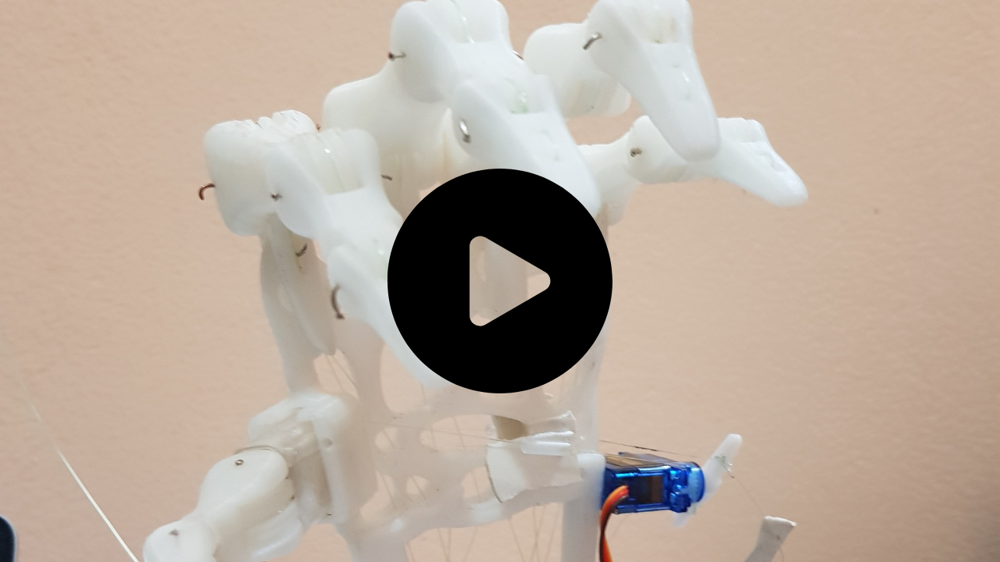](https://www.youtube.com/watch?v=Xmg6TJ2kYnA "Bionic Arm")

  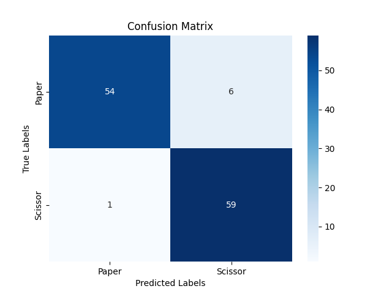

    
 
    
 
  
 

## Installation and Running of project
We will have to setup the UI and API separately. Also, separate arduino code for prosthetic arm motion. 
    
## Follow these three steps as below

### 1. API setup

We are using fast API. Follow these steps in terminal

- `cd API` 
- `pip install -r requirements.txt` 
- `uvicorn main:app --reload` 

You will get INFO:     Uvicorn running on http://127.0.0.1:8000 (Press CTRL+C to quit) after fastapi runs successfully

### 2. UI setup

We are using React JS for front end. Follow following steps in terminal

- `cd UI` 
- `cd bionicarm` 
- `npm install` 
- `npm start` 

Now you are good to go. You can go to http://localhost:3000 to see the UI

You can upload the csv file which are collected from 2 channel sEMG sensor and get the predicted result from the model. 
The model is trained on only 2 classes "paper" and "scissors". 

You will also see the "arm motion in progress" prompt. 

### 3. Arduino setup

Now we setup the code for arduino to make finger movements in 3D printed arm. 

Follow these steps to upload the code to arduino. 

- `cd arduino` 
- Select the port for your arduino board
- Upload file close_motion.ino

Make sure to change the port for arduino NANO or UNO board at line 54 of main.py file.
    
- `API-> main.py -> Line 54 -> ser = serial.Serial('/dev/cu.usbmodem101', 9600)  # replace '/dev/cu.usbmodem101' with the appropriate port name`

Initially the arm will be set at rest condition.

## Yep we have done it and we are ready to do see our arm moving. 

Now upload any one of the csv file from "test" folder of this repo and see the model prediction and at the same time we can now see our 
bionic arm performing the predicted motion either "paper" or "scissors".

### 4. Real time implementation (Optional)

If you have working 2 channel sensors you can try this in real time. 
If you want to implement this project at real time then follow following steps to modify the code :

- `cd API` 
- `uvicorn realtime:app --reload` 
- `axios.get('http://127.0.0.1:8000/') # file directory UI -> bionicarm -> src -> components -> Uploadfile.js -> line 35` 

